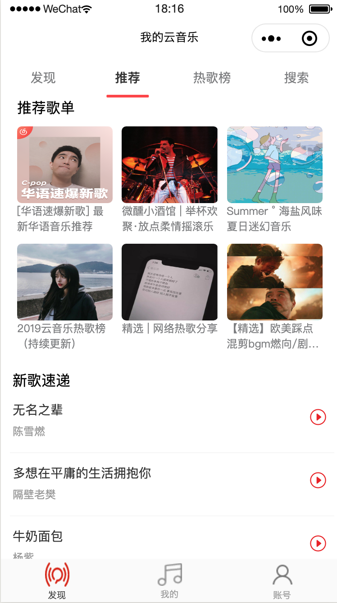
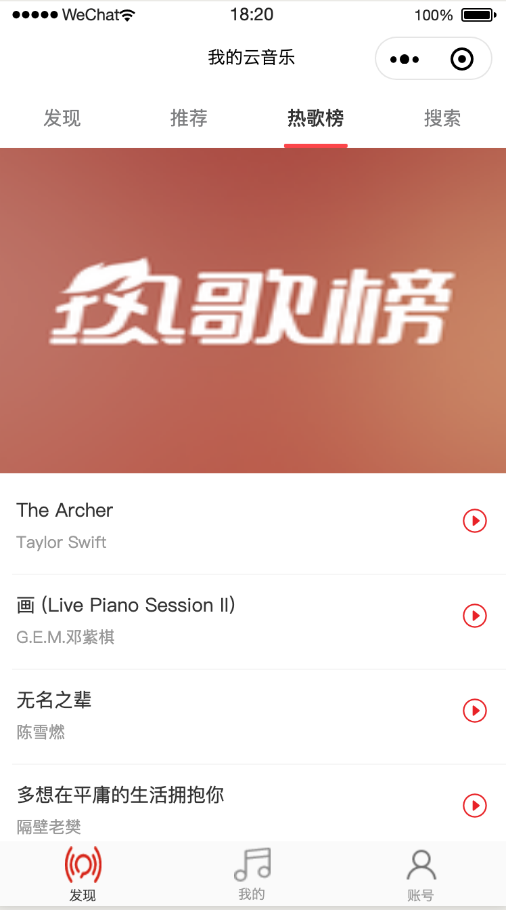
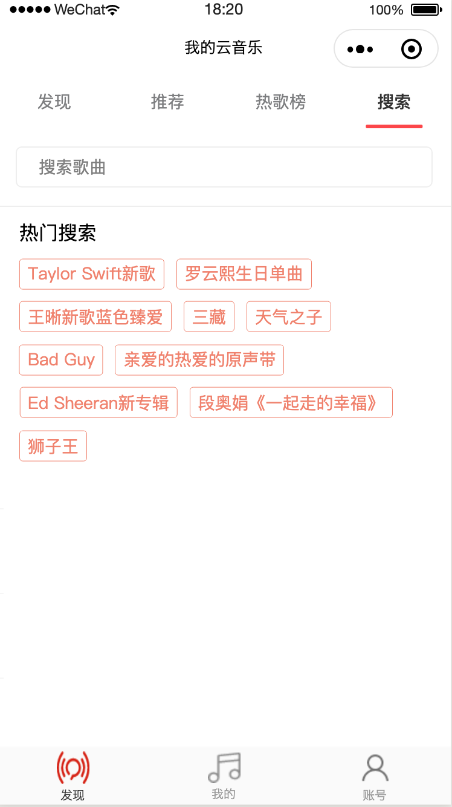
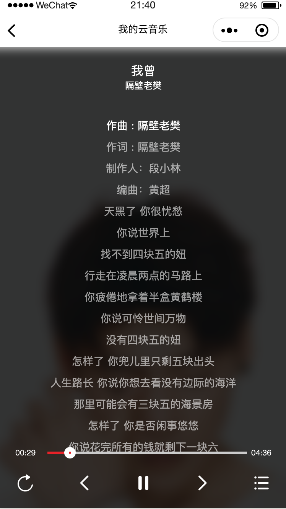

# 微信小程序版网易云音乐 练手demo
[github](https://github.com/a758801405/my-music) 地址

## 技术架构
- [mpvue](http://mpvue.com/mpvue/quickstart.html)   初始化项目
- UI框架:[vant Weapp](https://youzan.github.io/vant-weapp/#/icon) 
- HTTP请求:[flyio](https://wendux.github.io/dist/#/doc/flyio/readme)
- css预处理器:sass
- 微信小程序[api](https://developers.weixin.qq.com/miniprogram/dev/api/)

## 主要功能和模块
### 已实现  
首页   
每日推荐  
排行榜  
电台  
新歌榜  
热歌榜  
搜索  
播放  

### 待实现  
我的  
账号  

## 构建命令
npm run dev  

## 预览

  
 
   
 

