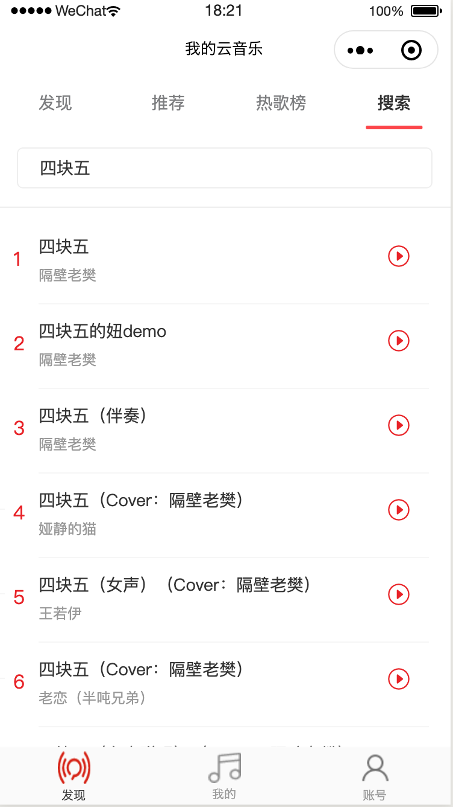

# 微信小程序版网易云音乐 练手demo
[github](https://github.com/a758801405/my-music) 地址

## 技术架构
- mpvue 初始化项目
- UI框架：[vant Weapp](https://youzan.github.io/vant-weapp/#/icon)
- HTTP请求：[flyio](https://wendux.github.io/dist/#/doc/flyio/readme) 和自己封装的请求
- css预处理器：sass
- 微信小程序[api](https://developers.weixin.qq.com/miniprogram/dev/api/)

## 主要功能和模块
### 已实现
- 首页
- 每日推荐
- 排行榜
- 电台
- 新歌榜
- 热歌榜
- 搜索
- 热门搜索
- 播放
- 暂停
- 歌词预览

### 待实现
- 我的
- 账号

## 构建命令
npm run dev

## 预览

